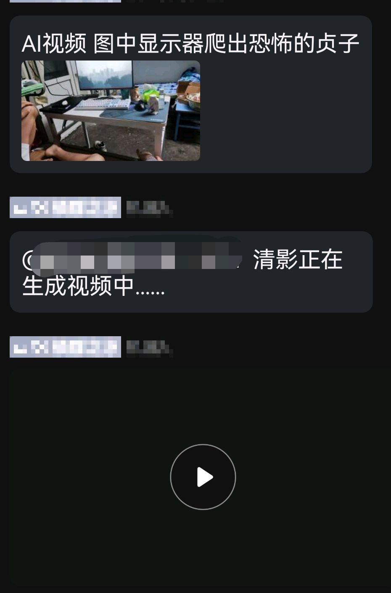

<div align="center">
  <a href="https://v2.nonebot.dev/store"></a>
  <br>
  <p></p>
</div>

<div align="center">

# nonebot-plugin-chatgpt-turbo
</div>

# 介绍
- 本插件适配智谱清言的cogvideox视频生成模型API，具有文字生成视频和图文生成视频的功能。
- 使用cogvideox-flash模型免费
# 安装

* 手动安装
  ```
  git clone https://github.com/Alpaca4610/nonebot_plugin_cogvideox.git
  ```

  下载完成后在bot项目的pyproject.toml文件手动添加插件：

  ```
  plugin_dirs = ["xxxxxx","xxxxxx",......,"下载完成的插件路径/nonebot_plugin_cogvideox.git"]
  ```
* 使用 pip
  ```
  pip install nonebot-plugin-cogvideox.git
  ```

# 配置文件

在Bot根目录下的.env文件中追加如下内容：

```
zhipu_key = ""  # （必填）智谱清言清影API KEY


video_model: str = "cogvideox-flash" # （可选）视频模型，cogvideox-flash免费
video_quality: str = "quality"  # （可选）输出模式，"quality"为质量优先，"speed"为速度优先
video_size: str = "1920x1080"  # （可选）视频分辨率，支持最高4K（如: "3840x2160"）
video_fps : str = 30  # （可选）帧率，可选为30或60
```
[API KEY获取地址](https://open.bigmodel.cn/usercenter/apikeys)
# 效果



# 使用方法

- AI视频 文字提示词(图片)
